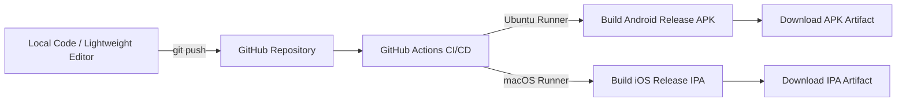

# 🚀 Building Flutter .APK and .IPA Without Android Studio, Xcode, or a Mac

A developer's guide to writing Flutter applications locally in a lightweight setup (like VS Code) and automatically compiling production **Android Release `.apk`** and **iOS `.ipa`** binaries in the cloud using **GitHub Actions CI/CD** — 100% free, without local hardware limitations.

---

## 📌 Table of Contents
- [The Developer Dilemma: Local Hardware Barriers](#the-developer-dilemma-local-hardware-barriers)
- [The Cloud Solution: GitHub Actions](#the-cloud-solution-github-actions)
- [How Cloud CI/CD Works Under the Hood](#how-cloud-cicd-works-under-the-hood)
- [The Complete Workflow Configuration](#the-complete-workflow-configuration)
- [Step-by-Step Execution Guide](#step-by-step-execution-guide)
  - [1. Push Code to GitHub](#1-push-code-to-github)
  - [2. Monitor Cloud Build Pipeline](#2-monitor-cloud-build-pipeline)
  - [3. Download Your Binaries](#3-download-your-binaries)
- [Pro Tips for Production & Code Signing](#pro-tips-for-production--code-signing)
- [Key Benefits & Summary](#key-benefits--summary)

---

## 🛑 The Developer Dilemma: Local Hardware Barriers

When developing cross-platform applications with Flutter, the promise is simple: **write one codebase and deploy everywhere**. However, developers frequently encounter severe local hardware bottlenecks:

1. **The Heavy Weight of Android Studio & SDKs:**
   - Android Studio, emulators, and SDKs easily take up 15–20 GB of storage.
   - Running the Gradle build daemon locally on systems with 8 GB or 16 GB of RAM leads to system slowdowns, high CPU temperatures, and frequent build crashes.

2. **The "Apple Wall" (macOS & Xcode Exclusivity):**
   - Generating iOS builds (`.ipa` / Runner app) natively requires a physical Apple Mac and an installation of Xcode (30+ GB).
   - For students, freelancers, or developers starting on Windows or Linux, purchasing an expensive MacBook solely for compiling iOS test builds is impractical.

---

## 💡 The Cloud Solution: GitHub Actions

Instead of burning local CPU cycles, disk space, and budget on dedicated hardware, you can delegate the entire build process to **GitHub Actions**:

- 🐧 **Linux (Ubuntu) Cloud Runners:** High-speed cloud servers pre-configured with Java, Gradle, and Android build tools to compile `.apk` files rapidly.
- 🍏 **macOS Cloud Runners:** Dedicated cloud-hosted Apple Mac machines with **Xcode pre-installed**, enabling you to build and package iOS `.ipa` archives for free.

---

## ⚙️ How Cloud CI/CD Works Under the Hood



1. You write Dart code locally in a lightweight editor (like **VS Code**).
2. You push your commits to GitHub.
3. GitHub automatically provisions Ubuntu and macOS cloud virtual machines in parallel.
4. Once compilation completes, your ready-to-install `.apk` and `.ipa` files are attached directly under your repository's **Artifacts** tab.

---

## 📄 The Complete Workflow Configuration

Create a single YAML configuration file at `.github/workflows/build.yml` in your project root:

```yaml
name: Build Flutter APK & IPA

on:
  push:
    branches: [ main, master ]
  pull_request:
    branches: [ main, master ]
  workflow_dispatch: # Allows manual one-click trigger from GitHub Actions UI

jobs:
  # ==========================================
  # 1. Android APK Build Job
  # ==========================================
  build-apk:
    name: Build Android APK
    runs-on: ubuntu-latest

    steps:
      - name: Checkout Repository Code
        uses: actions/checkout@v4

      - name: Setup Java JDK 17
        uses: actions/setup-java@v4
        with:
          distribution: 'temurin'
          java-version: '17'

      - name: Setup Flutter Environment
        uses: subosito/flutter-action@v2
        with:
          channel: 'stable'
          cache: true

      - name: Install Dependencies
        run: flutter pub get

      - name: Compile Release APK
        run: flutter build apk --release

      - name: Upload Android APK
        uses: actions/upload-artifact@v4
        with:
          name: Android-Release-APK
          path: build/app/outputs/flutter-apk/app-release.apk
          retention-days: 14

  # ==========================================
  # 2. iOS IPA Build Job
  # ==========================================
  build-ipa:
    name: Build iOS IPA
    runs-on: macos-latest # 👈 Utilizes cloud-hosted Apple Mac hardware

    steps:
      - name: Checkout Repository Code
        uses: actions/checkout@v4

      - name: Setup Flutter Environment
        uses: subosito/flutter-action@v2
        with:
          channel: 'stable'
          cache: true

      - name: Install Dependencies
        run: flutter pub get

      - name: Build iOS Application (Unsigned)
        run: flutter build ios --release --no-codesign

      - name: Package Payload into Installable .ipa
        run: |
          mkdir -p Payload
          cp -r build/ios/iphoneos/Runner.app Payload/
          zip -r app-release-unsigned.ipa Payload

      - name: Upload iOS IPA
        uses: actions/upload-artifact@v4
        with:
          name: iOS-Release-IPA
          path: app-release-unsigned.ipa
          retention-days: 14
```

---

## 🛠️ Step-by-Step Execution Guide

### 1. Push Code to GitHub
Ensure all your files and workflow configurations are pushed to your remote repository:
```bash
git add .
git commit -m "Add GitHub Actions build pipeline"
git push origin main
```

### 2. Monitor Cloud Build Pipeline
1. Open your repository on [GitHub](https://github.com).
2. Click on the **Actions** tab at the top.
3. Select the latest workflow run (`Build Flutter APK & IPA`).
4. You will observe both the `Build Android APK` and `Build iOS IPA` jobs executing in parallel.

### 3. Download Your Binaries
Once the jobs finish green (typically 4–6 minutes):
1. Scroll down to the **Artifacts** section at the bottom of the workflow run summary.
2. Download your compiled packages:
   - 📦 **`Android-Release-APK`**: Contains `app-release.apk` ready to install directly onto Android devices.
   - 📦 **`iOS-Release-IPA`**: Contains `app-release-unsigned.ipa` ready for iOS testing and distribution.

---

## 💡 Pro Tips for Production & Code Signing

- **For Official App Store Submissions:** You can securely store your Apple Developer certificates (`.p12` file and mobileprovision profile) inside **GitHub Secrets** (`Settings -> Secrets and variables -> Actions`) to generate signed `.ipa` files automatically.
- **For Google Play Store Submissions:** You can build an **Android App Bundle** by adding `flutter build appbundle --release` alongside your APK step.
- **Retention Period:** Artifacts are kept on GitHub servers for 14 days (customizable up to 90 days).

---

## 🌟 Key Benefits & Summary

- **Zero Heavy Toolchains:** Keep your local machine clean without gigabytes of SDKs and emulator images.
- **Hardware Independence:** Build iOS binaries seamlessly from Windows or Linux.
- **Automated & Repeatable:** Every push produces consistent, production-grade release builds.
- **Developer Productivity:** Spend time writing feature code rather than wrestling with local compilation errors.
